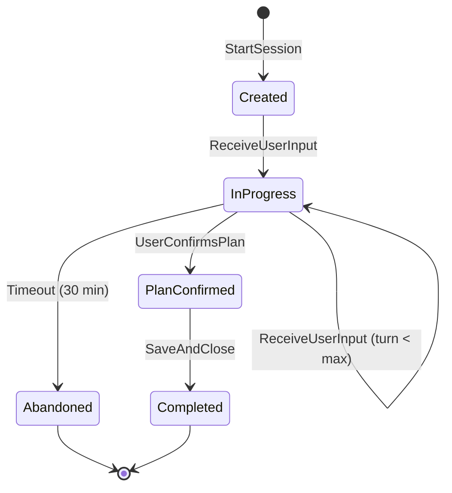
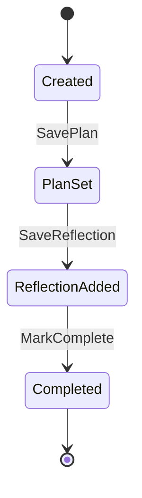
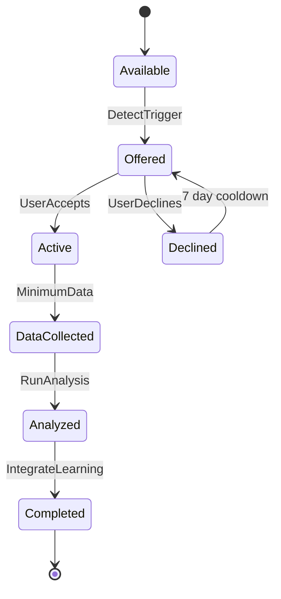
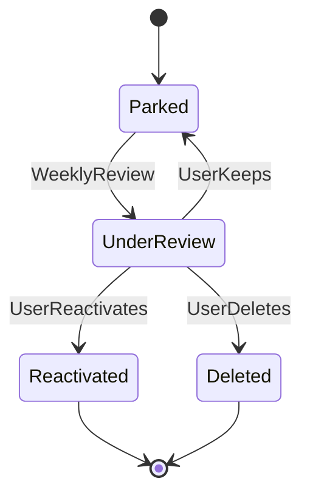

# Claru - Technical Architecture v2

> **Repo Path:** `claru/docs/technical-architecture.md`
> **Related Docs:** 
> - `claru/docs/context-map.md` — Bounded Context Definitions
> - `claru/docs/contexts/*.md` — Individual Context Canvases

**Product:** Claru
**Phase:** Technical Architecture
**Status:** Ready for Implementation
**Version:** 2.0
**Last Updated:** January 2026

---

## Executive Summary

This document defines the technology stack for Claru, an AI productivity coaching app built by a solo non-technical founder. The architecture prioritizes speed-to-market and developer experience while maintaining clear migration paths if costs spike at scale.

**External validation:** This architecture was reviewed by GPT-4, Gemini, and Perplexity Deep Research. All three validated the core stack choices and identified cost projection errors that have been corrected in this version.

### Stack At A Glance

| Layer | Choice | Why |
|-------|--------|-----|
| **Frontend + Backend** | Next.js 14 on Vercel | Best AI streaming support, unified deployment |
| **Database + Auth** | Supabase (PostgreSQL) | Bundled services, RLS, generous free tier |
| **AI Model** | Claude 4.5 Sonnet | Best coaching quality, multi-turn coherence |
| **AI SDK** | Vercel AI SDK | Simple streaming, provider abstraction |
| **Voice Transcription** | Deepgram Nova-3 | Real-time streaming, sub-second latency |
| **Architecture** | Modular Monolith | Solo founder, 9 bounded contexts, can extract later |

### Cost Reality (January 2026 Pricing)

| DAU | Vercel | Supabase | Claude | Deepgram | **Total** |
|-----|--------|----------|--------|----------|-----------|
| 100 | $0 | $0 | ~$70 | ~$60 | **~$130/mo** |
| 500 | $0 | $0 | ~$350 | ~$290 | **~$640/mo** |
| 1,000 | $20 | $0 | ~$700 | ~$580 | **~$1,300/mo** |
| 5,000 | $20 + $195 | $25 | ~$3,500 | ~$2,900 | **~$6,640/mo** |

*Assumptions: 2 sessions/day, ~3,100 tokens input + ~700 tokens output per session, 30% voice usage at 5 min/session*

**Cost mitigation:** If costs spike, user gating is acceptable. Cloudflare Workers migration (Option C) documented as escape hatch.

---

## Key Terms Glossary

| Term | Plain English Definition |
|------|-------------------------|
| **Frontend** | The part users see and interact with (the app interface) |
| **Backend** | The server-side code that processes requests and talks to the database |
| **API** | How the frontend talks to the backend (like a waiter taking orders to the kitchen) |
| **Database** | Where all your data is stored permanently |
| **Serverless** | Code that runs on-demand without managing servers (you pay per use) |
| **Edge Functions** | Code that runs close to users geographically for faster responses |
| **Streaming** | Sending data piece by piece instead of all at once (for AI responses appearing word by word) |
| **Row-Level Security (RLS)** | Database rules that automatically restrict which rows each user can see |
| **WebSocket** | A connection that stays open for real-time two-way communication |
| **Cold Start** | Delay when a serverless function hasn't been used recently and needs to "wake up" |
| **TTFT** | Time To First Token — how long until the AI starts responding |
| **pgvector** | PostgreSQL extension for storing and searching vector embeddings (for AI memory) |

---

## Option A: Vercel + Supabase (Recommended for MVP)

This is the "batteries included" option — everything works together out of the box.

### Architecture Diagram

```
┌─────────────────────────────────────────────────────────────────┐
│                        USER'S BROWSER                            │
│  ┌─────────────────────────────────────────────────────────┐    │
│  │                    Next.js Frontend                      │    │
│  │  • React UI (chat, notes, insights)                     │    │
│  │  • Direct WebSocket to Deepgram (voice)                 │    │
│  └─────────────────────────────────────────────────────────┘    │
└─────────────────────────────────────────────────────────────────┘
          │                              │
          │ HTTPS (API calls)            │ WebSocket (voice)
          ▼                              ▼
┌─────────────────────────────────────────────────────────────────┐
│                         VERCEL                                   │
│  ┌─────────────────────────────────────────────────────────┐    │
│  │              Next.js API Routes (Node.js Runtime)        │    │
│  │  • /api/coaching/* — Coaching Engine                    │    │
│  │  • /api/users/* — User Context Store                    │    │
│  │  • /api/challenges/* — Challenge Engine                 │    │
│  │  • /api/parking/* — Parking Lot Manager                 │    │
│  │  • /api/insights/* — Insights Engine                    │    │
│  │  • /api/engagement/* — Engagement Tracker               │    │
│  │  • /api/capture/* — Capture Service                     │    │
│  └─────────────────────────────────────────────────────────┘    │
│  ┌─────────────────────────────────────────────────────────┐    │
│  │              Vercel AI Gateway (Observability)           │    │
│  │  • Latency metrics, error rates, token usage            │    │
│  │  • Rate limiting, fallback routing                      │    │
│  └─────────────────────────────────────────────────────────┘    │
└─────────────────────────────────────────────────────────────────┘
          │                    │                    │
          ▼                    ▼                    ▼
┌─────────────────┐  ┌─────────────────┐  ┌─────────────────┐
│    Supabase     │  │    Anthropic    │  │    Deepgram     │
│                 │  │   Claude 4.5    │  │    Nova-3       │
│ • PostgreSQL    │  │    Sonnet       │  │                 │
│ • Auth          │  │                 │  │ • Real-time STT │
│ • Edge Functions│  │ • Streaming     │  │ • WebSocket API │
│ • Storage       │  │ • Coaching AI   │  │                 │
└─────────────────┘  └─────────────────┘  └─────────────────┘
```

### ⚠️ Critical: Voice Architecture

> **Vercel serverless functions cannot maintain WebSocket connections.**
> Voice transcription MUST be client-side — browser connects directly to Deepgram.

**Correct:**
```
Browser ──WebSocket──► Deepgram (real-time transcription)
Browser ──HTTPS POST──► Vercel API (send completed transcript to Claude)
```

**Wrong (will fail):**
```
Browser ──► Vercel API ──► Deepgram  ← Function will timeout
```

---

## Component Specifications

### Frontend + Backend: Next.js 14 on Vercel

**What it is:** React framework that handles both UI and backend API routes in one project. Vercel is the hosting platform built by the Next.js creators.

**Why it fits Claru:**
- First-class streaming support for AI responses via Vercel AI SDK
- Unified deployment — one codebase, one deploy command
- App Router with Server Actions accelerates development
- ~50% faster dev startup, ~95% faster hot-refresh vs older versions

**Vercel Function Limits:**

| Plan | Default Timeout | Max Configurable | Fluid Compute Max |
|------|-----------------|------------------|-------------------|
| Hobby | 10 seconds | 60 seconds | 300 seconds |
| Pro ($20/mo) | 15 seconds | 300 seconds | 800 seconds |

**Runtime Selection:**
- **Node.js Runtime:** Use for coaching routes (complex logic, streaming)
- **Edge Runtime:** Use for simple fetches (faster cold starts)

**Risks & Mitigations:**

| Risk | Mitigation |
|------|------------|
| Streaming counts as execution time | Cap sessions at 15 turns (morning), 10 turns (evening) |
| Cold starts (100-500ms) | Acceptable for MVP; monitor p95 latency |
| Function overage at scale | ~$0.18/hour after 1,000 free hours; Cloudflare escape hatch |
| "Vercel Tax" at high scale | Document migration path to Railway or Cloudflare |

---

### Database + Auth: Supabase (PostgreSQL)

**What it is:** Backend-as-a-service with PostgreSQL, auth, storage, edge functions, and real-time subscriptions bundled together.

**Why it fits Claru:**
- Auth included — User Identity context solved
- Row-Level Security (RLS) — Database enforces "users only see their own data"
- PostgreSQL with JSONB — Relational core + flexible JSON for plans, reflections
- Edge Functions — Background jobs for weekly reports, pattern analysis
- Recent uptime: 99.88%-100% (Nov 2025 - Jan 2026)

**Free Tier Limits:**

| Resource | Free Tier | Pro ($25/mo) |
|----------|-----------|--------------|
| Database | 500 MB | 8 GB |
| Storage | 1 GB | 100 GB |
| MAU (auth) | 50,000 | 100,000 |
| Edge Function CPU | 2 seconds | 50 seconds |
| Realtime Connections | 200 | 500 |

**⚠️ Critical Gotcha: Database Pause**

> Supabase free tier projects **pause after 7 days of inactivity**. First request after pause takes 5-10 seconds.

**Solution: Keep-Alive Cron**

```yaml
# .github/workflows/keep-supabase-alive.yml
name: Keep Supabase Awake
on:
  schedule:
    - cron: "0 9 */3 * *"  # Every 3 days at 09:00 UTC
jobs:
  ping:
    runs-on: ubuntu-latest
    steps:
      - name: Ping Supabase
        run: |
          curl -s "${{ secrets.SUPABASE_URL }}/rest/v1/" \
            -H "apikey: ${{ secrets.SUPABASE_ANON_KEY }}" || true
```

**Risks & Mitigations:**

| Risk | Mitigation |
|------|------------|
| Database pause on free tier | Keep-alive cron; upgrade to Pro when serious |
| Edge Function timeout (2s free) | Upgrade to Pro for heavy analytics jobs |
| RLS misconfiguration | Test policies thoroughly; use Security Advisor |
| Vendor lock-in | Supabase is open-source; can self-host if needed |

---

### AI Model: Claude 4.5 Sonnet

**What it is:** Anthropic's current mid-tier model (January 2026). Successor to 3.5 Sonnet with improved reasoning at the same price.

**Why it fits Claru:**
- Best multi-turn coherence — remembers context across 6-8 turn conversations
- Strong "emotional intelligence" — responses feel human, not generic
- Low hallucination rate (2-3%) vs cheaper models (8-12%)
- Good balance of quality, speed, and cost

**Model Comparison (January 2026):**

| Model | Input/1M | Output/1M | TTFT | Hallucination | Best For |
|-------|----------|-----------|------|---------------|----------|
| Claude 4.5 Opus | $15 | $75 | ~1.5s | Very Low | Complex reasoning |
| **Claude 4.5 Sonnet** | **$3** | **$15** | **~0.8s** | **Low (2-3%)** | **Coaching** ✅ |
| Claude 4.5 Haiku | $1 | $5 | ~0.4s | Medium (8-12%) | Simple utilities |

**Token Budget Per Session:**

| Component | Tokens |
|-----------|--------|
| System prompt (persona, rules, guardrails) | ~1,500 |
| User context (yesterday, carryover, patterns) | ~500 |
| Conversation history (last 4-6 turns) | ~800 |
| Current user input | ~300 |
| **Total Input** | **~3,100** |
| AI response | ~700 |
| **Total Output** | **~700** |

**Cost Per Session:**
- Input: 3,100 tokens × $3/1M = $0.0093
- Output: 700 tokens × $15/1M = $0.0105
- **Total: ~$0.02/session (~2 cents)**

**Future Optimization: Model Routing**

Services like Martian, Portkey, or OpenRouter can route to the cheapest capable model automatically. Not needed for MVP — revisit when optimizing costs.

---

### AI Integration: Vercel AI SDK

**What it is:** Library that simplifies streaming AI responses. Handles complexity of real-time token delivery.

**Why it fits Claru:**
- Streaming in ~5 lines of code (vs 50+ with raw API)
- Provider abstraction — can swap Claude for GPT-4 with minimal changes
- Built-in React hooks for chat interfaces
- Works with Vercel AI Gateway for observability

**Example:**

```typescript
// app/api/coaching/turn/route.ts
import { anthropic } from '@ai-sdk/anthropic';
import { streamText } from 'ai';

export async function POST(req: Request) {
  const { messages, systemPrompt, userId } = await req.json();

  const result = await streamText({
    model: anthropic('claude-sonnet-4-5-20250514'),
    system: systemPrompt,
    messages,
  });

  return result.toDataStreamResponse();
}
```

**Why not LangChain:**

| Factor | Vercel AI SDK | LangChain |
|--------|---------------|-----------|
| Complexity | Low | High |
| Streaming | Built-in | Requires setup |
| RAG/Agents | Basic | Excellent |
| Best for | Chat apps | Complex workflows |

**Decision:** Vercel AI SDK for MVP. Consider LangChain only if adding RAG or agent workflows later.

---

### Voice: Deepgram Nova-3

**What it is:** Speech-to-text API with real-time streaming capability.

**Why it fits Claru:**
- Sub-300ms latency — feels like instant transcription
- Real-time streaming via WebSocket — users see words as they speak
- Competitive accuracy (comparable to Whisper)
- Simple API integration

**Pricing (January 2026):**

| Mode | Price/Minute | Price/Hour | Best For |
|------|--------------|------------|----------|
| Real-time (Nova-3) | $0.0077 | $0.46 | Live coaching sessions |
| Batch | ~$0.0043 | ~$0.26 | Async processing |

**Implementation: Client-Side WebSocket**

```typescript
// hooks/useDeepgramTranscription.ts
export function useDeepgramTranscription() {
  const [transcript, setTranscript] = useState('');
  const socketRef = useRef<WebSocket | null>(null);

  const startListening = async () => {
    const socket = new WebSocket(
      'wss://api.deepgram.com/v1/listen?model=nova-3',
      ['token', process.env.NEXT_PUBLIC_DEEPGRAM_KEY]
    );

    socket.onmessage = (event) => {
      const data = JSON.parse(event.data);
      const word = data.channel?.alternatives?.[0]?.transcript;
      if (word) setTranscript(prev => prev + ' ' + word);
    };

    socketRef.current = socket;

    // Connect microphone
    const stream = await navigator.mediaDevices.getUserMedia({ audio: true });
    const recorder = new MediaRecorder(stream);
    recorder.ondataavailable = (e) => socket.send(e.data);
    recorder.start(250); // Send chunks every 250ms
  };

  return { transcript, startListening, stopListening };
}
```

**Risks & Mitigations:**

| Risk | Mitigation |
|------|------------|
| Deepgram outage | Text input fallback; feature flag to disable voice globally |
| Real-time costs high | Consider hybrid (real-time for check-ins, batch for captures) |
| Audio sent to Deepgram cloud | Document in privacy policy; get user consent |

---

### Architecture: Modular Monolith

**What it is:** Single codebase with clear internal boundaries between domains. All 9 bounded contexts in one Next.js project, organized in separate folders.

**Why it fits Claru:**
- Solo founder = one person deploying, debugging, maintaining
- All contexts share the same database — no service communication needed
- Can extract to microservices later if specific context needs independent scaling
- Dramatically simpler than microservices for early-stage

**Folder Structure:**

```
/src
├── /app
│   ├── /(marketing)        # Landing, pricing pages
│   ├── /(auth)             # Login, signup
│   ├── /(dashboard)        # Main coaching interface
│   │   ├── /check-in
│   │   ├── /notes
│   │   ├── /insights
│   │   └── /parking-lot
│   └── /api                # API routes by bounded context
│       ├── /coaching       # Coaching Engine
│       ├── /users          # User Context Store
│       ├── /challenges     # Challenge Engine
│       ├── /parking        # Parking Lot Manager
│       ├── /insights       # Insights Engine
│       ├── /engagement     # Engagement Tracker
│       ├── /capture        # Capture Service
│       └── /notifications  # Notifications
├── /modules                # Domain logic (not routes)
│   ├── /coaching
│   │   ├── prompts/        # System prompts, personas
│   │   ├── flows/          # Conversation flow logic
│   │   └── extraction/     # Work classification
│   ├── /transcription
│   │   └── deepgram.ts
│   └── /shared
│       ├── /db             # Supabase client, types
│       └── /auth           # Auth helpers
└── /lib
    └── /utils              # General utilities
```

**Cross-Module Rules:**
- Use `index.ts` barrel exports to define public API per module
- Prefix internal folders with `_` to indicate private
- Never import directly from another module's internal files

---

## Option C: Cloudflare Workers + D1 (Cost Escape Hatch)

If Vercel costs spike dramatically, Cloudflare offers ~75% infrastructure savings.

### When to Consider

| Trigger | Threshold |
|---------|-----------|
| Vercel bill | > $300/month |
| Total infra (excl. AI) | > $500/month |
| DAU | > 5,000 |

### Comparison

| Aspect | Vercel + Supabase | Cloudflare Workers + D1 |
|--------|-------------------|------------------------|
| Monthly cost (5K DAU) | ~$240 | ~$60 |
| Database | PostgreSQL | SQLite (D1) |
| Auth included | Yes | No (add Clerk, etc.) |
| Real-time subscriptions | Built-in | Need to build |
| Cold starts | 100-500ms | 0-50ms |
| WebSockets | Not supported | Native support |
| Ecosystem maturity | High | Growing |
| Migration effort | — | 2-4 weeks |

### Migration Path (If Needed)

1. Move API routes to Cloudflare Workers
2. Migrate database to D1 (SQLite) or Neon (PostgreSQL)
3. Replace Supabase Auth with Clerk or custom
4. Keep Next.js on Vercel (frontend only) or move to Cloudflare Pages

**Document this path but don't act until triggers are hit.**

---

## Data Architecture

### Database Schema

```sql
-- ============================================
-- USER CONTEXT STORE
-- ============================================

CREATE TABLE user_profiles (
  user_id UUID PRIMARY KEY REFERENCES auth.users(id) ON DELETE CASCADE,
  name TEXT,
  timezone TEXT DEFAULT 'America/New_York',
  preferences JSONB DEFAULT '{}',
  created_at TIMESTAMPTZ DEFAULT NOW(),
  updated_at TIMESTAMPTZ DEFAULT NOW()
);

CREATE TABLE daily_notes (
  id UUID PRIMARY KEY DEFAULT gen_random_uuid(),
  user_id UUID NOT NULL REFERENCES auth.users(id) ON DELETE CASCADE,
  date DATE NOT NULL,
  raw_dump TEXT,
  classified_work JSONB DEFAULT '[]',
  plan JSONB,  -- {top3: [], adminBatch: [], focusBlock: {}, meetingPrep: []}
  reflection JSONB,  -- {wins: [], learnings: [], released: []}
  completion_status JSONB DEFAULT '{}',
  state TEXT DEFAULT 'created' CHECK (state IN ('created', 'plan_set', 'reflection_added', 'completed')),
  created_at TIMESTAMPTZ DEFAULT NOW(),
  updated_at TIMESTAMPTZ DEFAULT NOW(),
  UNIQUE(user_id, date)
);

CREATE INDEX idx_daily_notes_user_date ON daily_notes(user_id, date DESC);

CREATE TABLE projects (
  id UUID PRIMARY KEY DEFAULT gen_random_uuid(),
  user_id UUID NOT NULL REFERENCES auth.users(id) ON DELETE CASCADE,
  name TEXT NOT NULL,
  description TEXT,
  notes TEXT,
  hotspot_id TEXT,  -- Future: links to 7 life areas (Mind, Body, Emotions, Career, Finances, Relationships, Fun)
  status TEXT DEFAULT 'active' CHECK (status IN ('active', 'parked', 'completed')),
  created_at TIMESTAMPTZ DEFAULT NOW(),
  updated_at TIMESTAMPTZ DEFAULT NOW(),
  UNIQUE(user_id, name)
);

CREATE INDEX idx_projects_user_status ON projects(user_id, status);

-- ============================================
-- COACHING ENGINE
-- ============================================

CREATE TABLE coaching_sessions (
  id UUID PRIMARY KEY DEFAULT gen_random_uuid(),
  user_id UUID NOT NULL REFERENCES auth.users(id) ON DELETE CASCADE,
  flow TEXT NOT NULL CHECK (flow IN ('morning_checkin', 'evening_checkin', 'adhoc')),
  state TEXT DEFAULT 'created' CHECK (state IN ('created', 'in_progress', 'plan_confirmed', 'completed', 'abandoned')),
  turn_count INTEGER DEFAULT 0,
  started_at TIMESTAMPTZ DEFAULT NOW(),
  completed_at TIMESTAMPTZ,
  metadata JSONB DEFAULT '{}'
);

CREATE INDEX idx_sessions_user_active ON coaching_sessions(user_id) 
  WHERE state IN ('created', 'in_progress');

CREATE TABLE conversation_turns (
  id UUID PRIMARY KEY DEFAULT gen_random_uuid(),
  session_id UUID NOT NULL REFERENCES coaching_sessions(id) ON DELETE CASCADE,
  turn_number INTEGER NOT NULL,
  user_input TEXT,
  ai_response TEXT,
  extracted_data JSONB,
  tokens_in INTEGER,
  tokens_out INTEGER,
  latency_ms INTEGER,
  created_at TIMESTAMPTZ DEFAULT NOW()
);

CREATE INDEX idx_turns_session ON conversation_turns(session_id, turn_number);

-- ============================================
-- CHALLENGE ENGINE
-- ============================================

CREATE TABLE user_challenges (
  id UUID PRIMARY KEY DEFAULT gen_random_uuid(),
  user_id UUID NOT NULL REFERENCES auth.users(id) ON DELETE CASCADE,
  challenge_id TEXT NOT NULL,
  status TEXT DEFAULT 'available' CHECK (status IN ('available', 'offered', 'declined', 'active', 'data_collected', 'analyzed', 'completed')),
  started_at TIMESTAMPTZ,
  completed_at TIMESTAMPTZ,
  data JSONB DEFAULT '{}',
  UNIQUE(user_id, challenge_id, started_at)
);

CREATE TABLE energy_logs (
  id UUID PRIMARY KEY DEFAULT gen_random_uuid(),
  user_id UUID NOT NULL REFERENCES auth.users(id) ON DELETE CASCADE,
  logged_at TIMESTAMPTZ NOT NULL,
  level INTEGER NOT NULL CHECK (level BETWEEN 1 AND 10),
  activity TEXT,
  created_at TIMESTAMPTZ DEFAULT NOW()
);

CREATE INDEX idx_energy_logs_user_time ON energy_logs(user_id, logged_at DESC);

CREATE TABLE challenge_learnings (
  id UUID PRIMARY KEY DEFAULT gen_random_uuid(),
  user_id UUID NOT NULL REFERENCES auth.users(id) ON DELETE CASCADE,
  challenge_id TEXT NOT NULL,
  learning_type TEXT NOT NULL,
  value JSONB NOT NULL,
  derived_at TIMESTAMPTZ DEFAULT NOW(),
  UNIQUE(user_id, learning_type)
);

-- ============================================
-- PARKING LOT MANAGER
-- ============================================

CREATE TABLE parked_items (
  id UUID PRIMARY KEY DEFAULT gen_random_uuid(),
  user_id UUID NOT NULL REFERENCES auth.users(id) ON DELETE CASCADE,
  text TEXT NOT NULL,
  reason TEXT,
  project TEXT,
  tags TEXT[] DEFAULT '{}',
  status TEXT DEFAULT 'parked' CHECK (status IN ('parked', 'under_review', 'reactivated', 'deleted')),
  parked_at TIMESTAMPTZ DEFAULT NOW(),
  last_reviewed_at TIMESTAMPTZ,
  source_session_id UUID REFERENCES coaching_sessions(id)
);

CREATE INDEX idx_parked_items_user_status ON parked_items(user_id, status);

-- ============================================
-- INSIGHTS ENGINE
-- ============================================

CREATE TABLE weekly_reports (
  id UUID PRIMARY KEY DEFAULT gen_random_uuid(),
  user_id UUID NOT NULL REFERENCES auth.users(id) ON DELETE CASCADE,
  week_start DATE NOT NULL,
  metrics JSONB NOT NULL,
  insights JSONB DEFAULT '[]',
  correlations JSONB DEFAULT '[]',
  generated_at TIMESTAMPTZ DEFAULT NOW(),
  UNIQUE(user_id, week_start)
);

CREATE TABLE user_patterns (
  id UUID PRIMARY KEY DEFAULT gen_random_uuid(),
  user_id UUID NOT NULL REFERENCES auth.users(id) ON DELETE CASCADE,
  pattern_type TEXT NOT NULL,
  data JSONB NOT NULL,
  confidence DECIMAL(3,2) NOT NULL,
  first_detected_at TIMESTAMPTZ DEFAULT NOW(),
  last_updated_at TIMESTAMPTZ DEFAULT NOW(),
  UNIQUE(user_id, pattern_type)
);

-- ============================================
-- ENGAGEMENT TRACKER
-- ============================================

CREATE TABLE engagement_records (
  user_id UUID PRIMARY KEY REFERENCES auth.users(id) ON DELETE CASCADE,
  last_checkin_at TIMESTAMPTZ,
  current_streak INTEGER DEFAULT 0,
  longest_streak INTEGER DEFAULT 0,
  habit_strength INTEGER DEFAULT 0 CHECK (habit_strength BETWEEN 0 AND 100),
  habit_trend TEXT DEFAULT 'stable' CHECK (habit_trend IN ('improving', 'stable', 'declining')),
  updated_at TIMESTAMPTZ DEFAULT NOW()
);

CREATE TABLE daily_engagements (
  user_id UUID NOT NULL REFERENCES auth.users(id) ON DELETE CASCADE,
  date DATE NOT NULL,
  morning_completed BOOLEAN DEFAULT FALSE,
  evening_completed BOOLEAN DEFAULT FALSE,
  PRIMARY KEY (user_id, date)
);

-- ============================================
-- CAPTURE SERVICE
-- ============================================

CREATE TABLE capture_items (
  id UUID PRIMARY KEY DEFAULT gen_random_uuid(),
  user_id UUID NOT NULL REFERENCES auth.users(id) ON DELETE CASCADE,
  text TEXT NOT NULL,
  source TEXT DEFAULT 'text' CHECK (source IN ('text', 'voice', 'widget', 'share')),
  audio_url TEXT,
  captured_at TIMESTAMPTZ DEFAULT NOW(),
  processed BOOLEAN DEFAULT FALSE,
  processed_at TIMESTAMPTZ,
  destination TEXT CHECK (destination IN ('plan', 'parked', 'deleted'))
);

CREATE INDEX idx_captures_user_unprocessed ON capture_items(user_id) 
  WHERE processed = FALSE;

-- ============================================
-- NOTIFICATIONS
-- ============================================

CREATE TABLE device_tokens (
  id UUID PRIMARY KEY DEFAULT gen_random_uuid(),
  user_id UUID NOT NULL REFERENCES auth.users(id) ON DELETE CASCADE,
  token TEXT NOT NULL,
  platform TEXT NOT NULL CHECK (platform IN ('ios', 'android', 'web')),
  created_at TIMESTAMPTZ DEFAULT NOW(),
  updated_at TIMESTAMPTZ DEFAULT NOW(),
  UNIQUE(user_id, token)
);

CREATE TABLE scheduled_notifications (
  id UUID PRIMARY KEY DEFAULT gen_random_uuid(),
  user_id UUID NOT NULL REFERENCES auth.users(id) ON DELETE CASCADE,
  type TEXT NOT NULL,
  scheduled_for TIMESTAMPTZ NOT NULL,
  content JSONB NOT NULL,
  status TEXT DEFAULT 'pending' CHECK (status IN ('pending', 'sent', 'failed', 'cancelled')),
  sent_at TIMESTAMPTZ,
  error TEXT,
  created_at TIMESTAMPTZ DEFAULT NOW()
);

CREATE INDEX idx_notifications_pending ON scheduled_notifications(scheduled_for) 
  WHERE status = 'pending';

-- ============================================
-- AI INFRASTRUCTURE
-- ============================================

CREATE TABLE ai_usage_logs (
  id UUID PRIMARY KEY DEFAULT gen_random_uuid(),
  user_id UUID NOT NULL REFERENCES auth.users(id) ON DELETE CASCADE,
  session_id UUID REFERENCES coaching_sessions(id),
  model TEXT NOT NULL,
  tokens_in INTEGER NOT NULL,
  tokens_out INTEGER NOT NULL,
  cost_usd DECIMAL(10,6),
  latency_ms INTEGER,
  error_type TEXT,
  created_at TIMESTAMPTZ DEFAULT NOW()
);

CREATE INDEX idx_ai_usage_user_time ON ai_usage_logs(user_id, created_at DESC);

-- Daily cost aggregation view
CREATE VIEW daily_costs AS
SELECT 
  date_trunc('day', created_at) as day,
  COUNT(DISTINCT user_id) as active_users,
  SUM(tokens_in) as total_tokens_in,
  SUM(tokens_out) as total_tokens_out,
  SUM(cost_usd) as total_cost_usd,
  SUM(cost_usd) / NULLIF(COUNT(DISTINCT user_id), 0) as cost_per_user
FROM ai_usage_logs
GROUP BY 1
ORDER BY 1 DESC;

-- ============================================
-- ROW-LEVEL SECURITY
-- ============================================

ALTER TABLE user_profiles ENABLE ROW LEVEL SECURITY;
ALTER TABLE daily_notes ENABLE ROW LEVEL SECURITY;
ALTER TABLE coaching_sessions ENABLE ROW LEVEL SECURITY;
ALTER TABLE conversation_turns ENABLE ROW LEVEL SECURITY;
ALTER TABLE user_challenges ENABLE ROW LEVEL SECURITY;
ALTER TABLE energy_logs ENABLE ROW LEVEL SECURITY;
ALTER TABLE challenge_learnings ENABLE ROW LEVEL SECURITY;
ALTER TABLE parked_items ENABLE ROW LEVEL SECURITY;
ALTER TABLE weekly_reports ENABLE ROW LEVEL SECURITY;
ALTER TABLE user_patterns ENABLE ROW LEVEL SECURITY;
ALTER TABLE engagement_records ENABLE ROW LEVEL SECURITY;
ALTER TABLE daily_engagements ENABLE ROW LEVEL SECURITY;
ALTER TABLE capture_items ENABLE ROW LEVEL SECURITY;
ALTER TABLE device_tokens ENABLE ROW LEVEL SECURITY;
ALTER TABLE scheduled_notifications ENABLE ROW LEVEL SECURITY;
ALTER TABLE ai_usage_logs ENABLE ROW LEVEL SECURITY;

-- Standard policy pattern: users can only access their own data
CREATE POLICY "Users own data" ON user_profiles
  FOR ALL USING (auth.uid() = user_id);

CREATE POLICY "Users own data" ON daily_notes
  FOR ALL USING (auth.uid() = user_id);

CREATE POLICY "Users own data" ON coaching_sessions
  FOR ALL USING (auth.uid() = user_id);

CREATE POLICY "Users own turns" ON conversation_turns
  FOR ALL USING (
    EXISTS (SELECT 1 FROM coaching_sessions WHERE id = session_id AND user_id = auth.uid())
  );

CREATE POLICY "Users own data" ON user_challenges
  FOR ALL USING (auth.uid() = user_id);

CREATE POLICY "Users own data" ON energy_logs
  FOR ALL USING (auth.uid() = user_id);

CREATE POLICY "Users own data" ON challenge_learnings
  FOR ALL USING (auth.uid() = user_id);

CREATE POLICY "Users own data" ON parked_items
  FOR ALL USING (auth.uid() = user_id);

CREATE POLICY "Users own data" ON weekly_reports
  FOR ALL USING (auth.uid() = user_id);

CREATE POLICY "Users own data" ON user_patterns
  FOR ALL USING (auth.uid() = user_id);

CREATE POLICY "Users own data" ON engagement_records
  FOR ALL USING (auth.uid() = user_id);

CREATE POLICY "Users own data" ON daily_engagements
  FOR ALL USING (auth.uid() = user_id);

CREATE POLICY "Users own data" ON capture_items
  FOR ALL USING (auth.uid() = user_id);

CREATE POLICY "Users own data" ON device_tokens
  FOR ALL USING (auth.uid() = user_id);

CREATE POLICY "Users own data" ON scheduled_notifications
  FOR ALL USING (auth.uid() = user_id);

CREATE POLICY "Users own data" ON ai_usage_logs
  FOR ALL USING (auth.uid() = user_id);
```

### Future: pgvector for Long-Term Memory

As usage grows, feeding full conversation history to Claude becomes expensive. **pgvector** enables semantic search over past sessions.

**When to add:** When token costs become significant (likely 5K+ DAU) or users have 30+ days of history.

```sql
-- Future migration
CREATE EXTENSION IF NOT EXISTS vector;

ALTER TABLE coaching_sessions 
ADD COLUMN summary_embedding vector(1536);

CREATE INDEX idx_session_embeddings 
ON coaching_sessions 
USING ivfflat (summary_embedding vector_cosine_ops);
```

---

## State Machines

### CoachingSession



| From | To | Trigger | Guard | Action |
|------|-----|---------|-------|--------|
| Created | InProgress | ReceiveUserInput | — | Increment turn_count |
| InProgress | InProgress | ReceiveUserInput | turn < 15 (morning) or < 10 (evening) | Generate AI response |
| InProgress | PlanConfirmed | UserConfirmsPlan | Has Top 3 | Save plan |
| InProgress | Abandoned | Timeout | 30 min no activity | Log |
| PlanConfirmed | Completed | SaveAndClose | — | Emit SessionCompleted |

### DailyNote



### UserChallenge



### ParkedItem



---

## Reliability & Fallbacks

### Claude API Fallback

```typescript
// lib/ai/coaching.ts
const FALLBACK_RESPONSES = {
  dump_phase: "I'm having trouble connecting right now. Go ahead and type out everything on your mind — I'll help organize it when I'm back online.",
  priority_phase: "Connection issue on my end. What are the top 3 things you want to accomplish today?",
  confirm_phase: "I couldn't save that properly. Can you confirm your Top 3 one more time?",
  reflect_phase: "Having trouble connecting. What were your wins today?",
};

async function generateCoachingResponse(input: CoachingInput) {
  try {
    return await withRetry(
      () => streamText({
        model: anthropic('claude-sonnet-4-5-20250514'),
        system: buildSystemPrompt(input),
        messages: input.messages,
      }),
      { maxRetries: 3, baseDelay: 1000, maxDelay: 5000 }
    );
  } catch (error) {
    // Log for monitoring
    await logAIError(input.userId, input.sessionId, error);
    
    // Queue user input for later processing
    await queueForRetry(input);
    
    // Return static fallback
    return {
      text: FALLBACK_RESPONSES[input.phase],
      fallback: true,
    };
  }
}
```

### Deepgram Fallback

```typescript
// components/VoiceCapture.tsx
function VoiceCapture({ onTranscript }) {
  const [voiceEnabled, setVoiceEnabled] = useState(true);
  const [consecutiveErrors, setConsecutiveErrors] = useState(0);

  const handleError = (error: Error) => {
    console.error('Voice error:', error);
    setConsecutiveErrors(prev => prev + 1);
    
    // After 3 consecutive errors, fall back to text
    if (consecutiveErrors >= 2) {
      setVoiceEnabled(false);
      toast("Voice isn't working right now. Let's use text instead.");
    }
  };

  if (!voiceEnabled) {
    return <TextInput onSubmit={onTranscript} />;
  }

  return <VoiceCaptureUI onError={handleError} />;
}
```

### Feature Flags

```typescript
// lib/featureFlags.ts
export const flags = {
  voice_enabled: process.env.NEXT_PUBLIC_VOICE_ENABLED === 'true',
};

// Can disable voice globally in seconds if Deepgram has outage
```

---

## Security

### Checklist

| Item | Implementation | Status |
|------|----------------|--------|
| RLS enabled on all tables | See schema above | Required |
| RLS policies tested | Create test users, verify isolation | Required |
| Supabase Security Advisor | Run before launch | Required |
| Rate limiting | Per-user limits on API routes | Required |
| Input validation | Zod schemas on all endpoints | Required |
| Secrets in env vars | Never commit API keys | Required |
| HTTPS everywhere | Vercel handles automatically | Automatic |

### Rate Limiting

```typescript
// middleware.ts
import { Ratelimit } from '@upstash/ratelimit';
import { Redis } from '@upstash/redis';

const ratelimit = new Ratelimit({
  redis: Redis.fromEnv(),
  limiter: Ratelimit.slidingWindow(20, '1 m'), // 20 requests per minute
});

export async function middleware(request: NextRequest) {
  if (request.nextUrl.pathname.startsWith('/api/coaching')) {
    const ip = request.ip ?? '127.0.0.1';
    const { success } = await ratelimit.limit(ip);

    if (!success) {
      return new Response('Too many requests', { status: 429 });
    }
  }
  return NextResponse.next();
}
```

### Per-User Cost Limits

```typescript
// Prevent "token drain" attacks
const MAX_DAILY_COST_PER_USER = 5.00; // $5/day

async function checkUserCostLimit(userId: string): Promise<boolean> {
  const { data } = await supabase
    .from('ai_usage_logs')
    .select('cost_usd')
    .eq('user_id', userId)
    .gte('created_at', new Date().toISOString().split('T')[0])
    .select();
  
  const dailyCost = data?.reduce((sum, row) => sum + row.cost_usd, 0) ?? 0;
  return dailyCost < MAX_DAILY_COST_PER_USER;
}
```

### Privacy & Consent

- [ ] Privacy policy documents AI (Anthropic) and voice (Deepgram) processing
- [ ] Voice consent modal before first recording
- [ ] Data retention policy documented (90 days default)
- [ ] Account deletion cascades all user data

---

## Observability

### Stack

| Tool | Purpose | Priority |
|------|---------|----------|
| **Sentry** | Error tracking, alerting | Day 1 |
| **Vercel AI Gateway** | AI latency, errors, tokens | Day 1 |
| **Supabase Dashboard** | DB metrics, query performance | Built-in |
| **Custom Cost Dashboard** | Daily AI + voice spend | Week 1 |

### Alerts

| Alert | Threshold | Action |
|-------|-----------|--------|
| AI latency p95 | > 45 seconds | Investigate; consider session caps |
| AI error rate | > 5% | Check Claude status; enable fallbacks |
| Daily AI cost | > $100 | Review usage; check for abuse |
| Deepgram error rate | > 10% | Enable text-only mode |

### Cost Monitoring Query

```sql
-- Daily cost summary
SELECT 
  day,
  active_users,
  total_cost_usd,
  cost_per_user
FROM daily_costs
WHERE day > NOW() - INTERVAL '30 days'
ORDER BY day DESC;
```

---

## Risk Summary

| Risk | Severity | Likelihood | Mitigation |
|------|----------|------------|------------|
| AI costs exceed budget | High | Medium | Daily monitoring, user gating, cost alerts |
| Voice costs spike | High | Medium | Hybrid real-time/batch, feature flag |
| Vercel execution costs at 5K+ DAU | Medium | Medium | Monitor p95, session caps, Cloudflare escape |
| Supabase free tier pause | Low | Low | Keep-alive cron, upgrade to Pro |
| Claude downtime | Medium | Low | Static fallbacks, queue for retry |
| Deepgram outage | Medium | Low | Text fallback, feature flag |
| RLS misconfiguration | High | Low | Test thoroughly, Security Advisor |
| Token drain attack | High | Low | Rate limiting, per-user cost caps |

---

## Prototype Plan

### Week 1: AI & Voice

| Prototype | Goal | Success Criteria | Time |
|-----------|------|------------------|------|
| Multi-turn coaching | Claude maintains context | Coherent 6-8 turn conversation | 2h |
| Streaming UX | Feels good on mobile | TTFT < 2s, p95 < 45s | 1h |
| Client-side Deepgram | WebSocket works | Real-time transcription, <500ms | 2h |

### Week 2: Infrastructure

| Prototype | Goal | Success Criteria | Time |
|-----------|------|------------------|------|
| Supabase schema + RLS | Security works | Policies pass isolation tests | 2h |
| Cost tracking | Monitor spend | Daily cost view working | 1h |
| Fallback flows | Graceful degradation | Text fallback works | 1h |

---

## Resolved Decisions

| Decision | Choice | Rationale |
|----------|--------|-----------|
| Stack | Vercel + Supabase | Fastest to MVP, minimal ops |
| Frontend/Backend | Next.js 14 | Best AI SDK support |
| Database | Supabase PostgreSQL | Auth + DB + Storage bundled |
| Auth | Supabase Auth | Zero additional integration |
| AI Model | Claude 4.5 Sonnet | Best coaching quality |
| AI SDK | Vercel AI SDK | Simple streaming |
| Voice | Deepgram Nova-3 (client-side) | Real-time, good accuracy |
| Architecture | Modular Monolith | Solo founder, can extract later |
| Cost control | Monitor + gate users | Acceptable at ~$1,300/mo for 1K DAU |
| Model routing | Sonnet for everything | Optimize later if needed |
| Escape hatch | Cloudflare (Option C) | Document, don't build yet |

---

## Next Steps

1. **Execute prototypes** (~8-10 hours)
2. **Set up project** — Initialize Next.js + Supabase
3. **Run database migrations** — Create all tables
4. **Configure observability** — Sentry, AI Gateway, cost logging
5. **Proceed to Phase 4** — Create Cursor rules to enforce architecture
